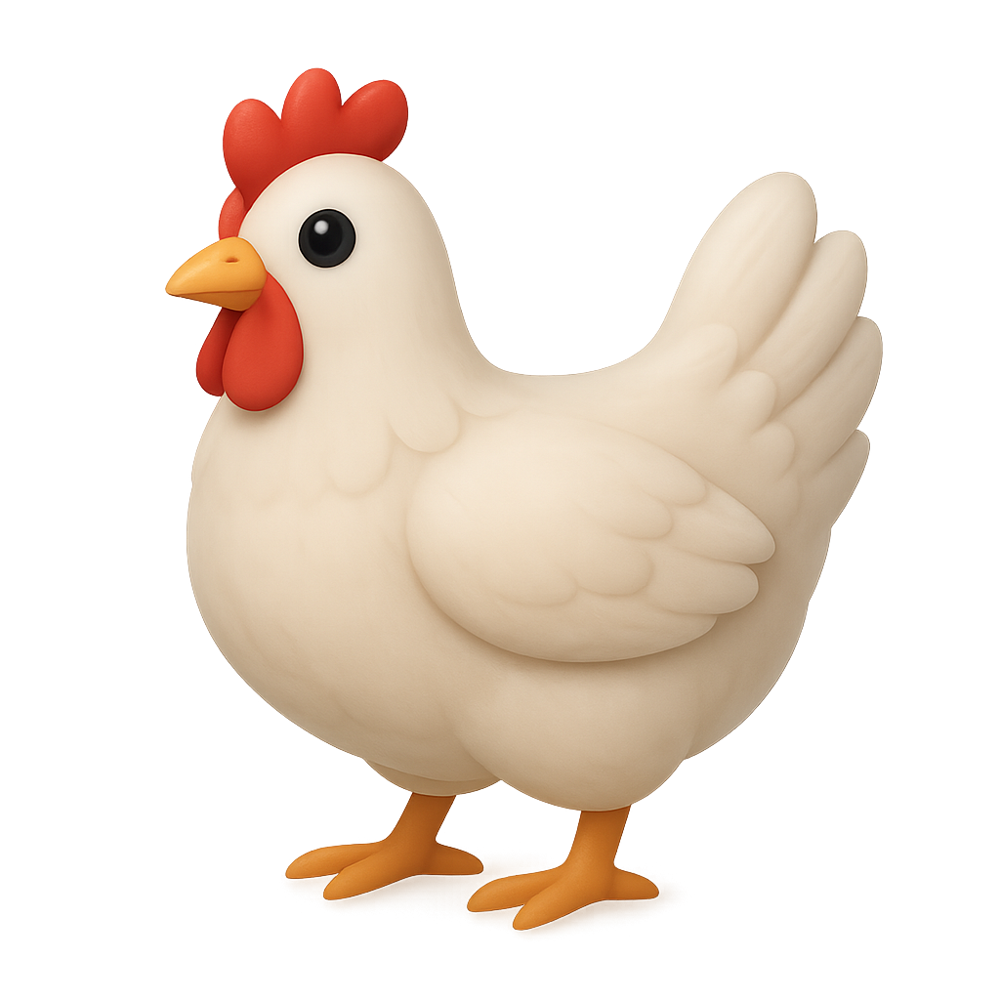

# 🍽️ MakeFOod

<p align="center">
   
</p>

A beautiful mobile app to discover, filter, and cook delicious recipes!  
Built with **React Native**, **Expo**, and powered by [TheMealDB API](https://www.themealdb.com/).

---

<p align="center">
  
  
  
  
</p>

---

## ✨ Features

- 🔍 **Browse Recipes:** Explore a wide variety of recipes from around the world.
- 🏷️ **Category Filtering:** Filter recipes by category (excluding Beef, Lamb, and Pork).
- 🌟 **Featured Recipe:** See a new featured recipe every time you open the app.
- 🔄 **Pull to Refresh:** Instantly refresh recipes and categories.
- 🖼️ **Recipe Details:** View ingredients, instructions, and images for each meal.
- ⚡ **Fast & Responsive:** Built with Expo for smooth cross-platform performance.

---

## 🚀 Getting Started

1. **Install dependencies**

   ```bash
   npm install
   ```

2. **Start the app**

   ```bash
   npx expo start
   ```

3. **Open on your device or emulator**
   - Scan the QR code with Expo Go, or use an Android/iOS emulator.

---

## 🗂️ Project Structure

- `app/` – Main app screens and navigation (file-based routing)
- `components/` – Reusable UI components (RecipeCard, CategoryFilter, etc.)
- `services/` – API logic (e.g., `mealAPI.js` for TheMealDB)
- `assets/` – Images and styles
- `constants/` – Color and style constants

---

## 🛠️ Customization

- **API Source:** Uses [TheMealDB](https://www.themealdb.com/api.php) for recipes.
- **Category Exclusion:** Beef, Lamb, and Pork are excluded by default in the category filter.
- **Styling:** Easily customize colors and styles in `assets/styles` and `constants/colors.js`.

---

## 🖼️ Screenshots

<p align="center">
  
  
</p>

---

## 🤝 Contributing

Pull requests and suggestions are welcome!  
Feel free to open an issue or submit a PR.

---

## 📄 License

MIT License

---

<p align="center">
  <sub>Made with ❤️ using React Native, Expo, and TheMealDB API</sub>
</p>
